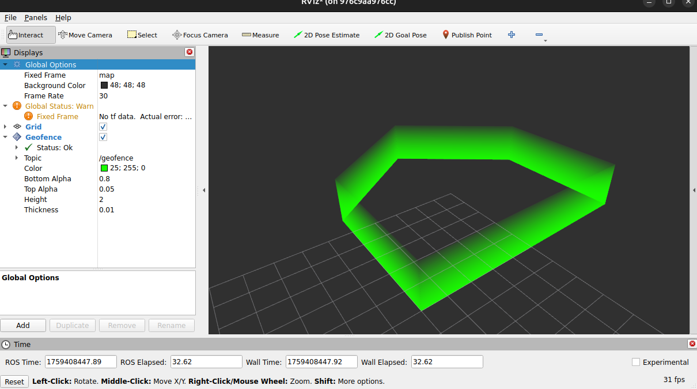

# `rviz_plugins`

Custom RViz plugins not directly associated with a specific repository

| Plugin | Description | Screenshot |
| --- | --- | --- |
| **Geofence Display** | Visualizes `geometry_msgs/msg/PolygonStamped` messages as geofences in RViz. |  |

## Launch Files

### [`rviz_plugins.launch.py`](launch/rviz_plugins.launch.py)

| Argument | Default | Description |
| --- | --- | --- |
| `name` | `"rviz"` | node name |
| `namespace` | `""` | node namespace |
| `config` | `os.path.join(get_package_share_directory("rviz_plugins"), "config", "conf.rviz")` | path to rviz config file |
| `log_level` | `"info"` | ROS logging level (debug, info, warn, error, fatal) |
| `use_sim_time` | `"false"` | use simulation clock |
